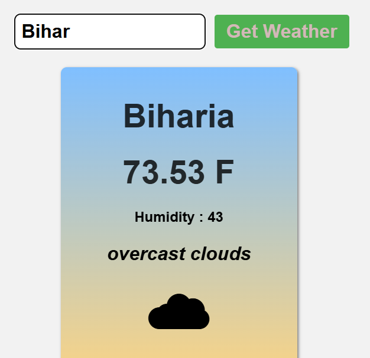

🌦️ Weather Website
A simple static weather web application that fetches real-time weather data using a public API. The user can search for a city and get current weather conditions like temperature, humidity, weather type, and more.

📸 Screenshot

🔗 Live Demo
Click here to view live
or replace with your GitHub Pages / Netlify / Vercel deployment link.

🚀 Features
Search for any city in the world.

Displays:
Temperature
Weather condition (e.g., clear, rainy)
Humidity
Wind speed
Weather icon
Responsive design for mobile and desktop.
Clean and modern UI.

🧑‍💻 Tech Stack
HTML
CSS
JavaScript
OpenWeatherMap API (or any other weather API you used)

🔧 How It Works
User enters a city name.

A fetch request is sent to the weather API with the entered city.

The JSON response is parsed.

Weather information is displayed on the page dynamically.

🔑 API Used
OpenWeatherMap – Free and easy-to-use weather data API.

## 🔗 GitHub Profile
[Parth Kamath](https://github.com/ParthK604)
